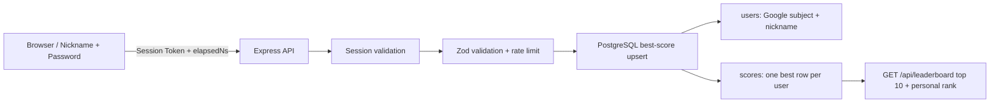

# Millisekund Global Leaderboard

## Arxitektura



1. Frontend nickname va parol bilan session token oladi va `Authorization: Bearer <token>` headerida yuboradi.
2. Backend session token hashini PostgreSQL orqali tekshiradi.
3. `elapsedNs` JSON'da string bo'ladi, chunki JavaScript `Number` nanosekund aniqligini 2^53 dan keyin yo'qotadi.
4. Railway PostgreSQL foydalanuvchini nickname orqali bir marta yaratadi va parol hashini saqlaydi.
5. SQL `ON CONFLICT ... WHERE` faqat yaxshiroq natijani saqlaydi; har bir urinish alohida yozilmaydi.
6. GET endpoint top-10, `current` shaxsiy o'rin va offset pagination ma'lumotini qaytaradi.

## Ishga tushirish

```powershell
npm install
Copy-Item .env.example .env
# .env ichiga Railway DATABASE_URL kiriting
npm start
```

API: `http://localhost:3000`

## API

### `POST /api/leaderboard/submit`

Header:

```http
Authorization: Bearer GOOGLE_ID_TOKEN
Content-Type: application/json
```

Body:

```json
{
  "elapsedNs": "1002024"
}
```

`elapsedNs` string bo'lishi shart. `1002024` ns = `1` ms, `1002` microsekund va `1002024` nanosekund. Har bir nickname faqat o'zining eng yaxshi rekordini saqlay oladi.

### `GET /api/leaderboard?limit=10&offset=0`

Autentifikatsiya ixtiyoriy. Bearer token yuborilsa, javobda top-10 bilan birga `current` foydalanuvchining shaxsiy o'rni qaytadi. `hasMore: true` bo'lsa, keyingi 10 qator uchun `offset=10` yuboriladi. `DATABASE_URL` Railway PostgreSQL connection string bo'lishi shart.

## Muhim anti-cheat chegarasi

Google token foydalanuvchi shaxsini ishonchli tekshiradi, lekin brauzerda o'lchangan vaqt qiymatini o'z-o'zidan ishonchli qila olmaydi: foydalanuvchi client payload'ini o'zgartirishi mumkin. Haqiqiy cheat-resistant musobaqada start/finish hodisalari authoritative game serverda o'lchanishi yoki server-issued signed challenge bilan tekshirilishi kerak. Ushbu API identity, format, limit, global uniqueness va faqat-yaxshilanadigan rekord invariantlarini himoya qiladi.
