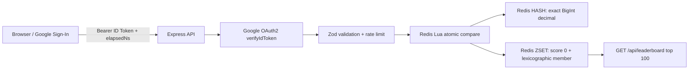

# Millisekund Global Leaderboard

## Arxitektura



1. Frontend Google orqali ID token oladi va `Authorization: Bearer <token>` headerida yuboradi.
2. Backend token imzosini Google public key, issuer va `GOOGLE_CLIENT_ID` audience orqali tekshiradi.
3. `elapsedNs` JSON'da string bo'ladi, chunki JavaScript `Number` nanosekund aniqligini 2^53 dan keyin yo'qotadi.
4. Redis Lua skripti bitta tranzaksiyada foydalanuvchining eski rekordini solishtiradi, yomon rekordni rad etadi va yaxshisini almashtiradi.
5. ZSET score ataylab `0` qilinadi. Nanosekund fixed-width member boshida joylashgani uchun `ZRANGE ... BYLEX` exact tartibni saqlaydi; Redis double score'iga katta nanosekund yozilmaydi.
6. GET endpoint HASH'dagi qiymatni millisekund, mikrosekund va nanosekund sifatida qaytaradi.

## Ishga tushirish

```powershell
npm install
Copy-Item .env.example .env
# .env ichiga Google Web OAuth Client ID kiriting
docker compose up -d redis
npm start
```

API: `http://localhost:3000`

## API

### `POST /api/leaderboard/submit`

Header:

```http
Authorization: Bearer GOOGLE_ID_TOKEN
Content-Type: application/json
```

Body:

```json
{
  "nickname": "tezkor_01",
  "elapsedNs": "1002024"
}
```

`elapsedNs` string bo'lishi shart. `1002024` ns = `1` ms, `1002` microsekund va `1002024` nanosekund. Har bir Google subject faqat o'zining eng yaxshi rekordini saqlay oladi.

### `GET /api/leaderboard`

Autentifikatsiya talab qilmaydi va global top-100 ni bir xil tartibda qaytaradi.

## Muhim anti-cheat chegarasi

Google token foydalanuvchi shaxsini ishonchli tekshiradi, lekin brauzerda o'lchangan vaqt qiymatini o'z-o'zidan ishonchli qila olmaydi: foydalanuvchi client payload'ini o'zgartirishi mumkin. Haqiqiy cheat-resistant musobaqada start/finish hodisalari authoritative game serverda o'lchanishi yoki server-issued signed challenge bilan tekshirilishi kerak. Ushbu API identity, format, limit, global uniqueness va faqat-yaxshilanadigan rekord invariantlarini himoya qiladi.
